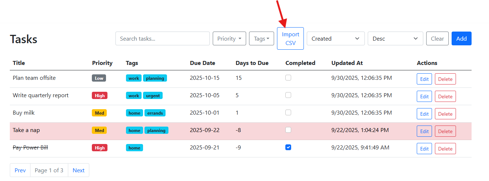

# AI-Driven SDLC Guidelines With Hands-On

## Goal
Learn how to adopt and leverage AI tools to optimize every step in the SDLC process. This guideline provides detailed step by step hands on approach with tool-specific examples, prompts, and best practices. You will learn by applying these steps to build a complete **Todo** service end-to-end using a single **.NET 8 WebAPI** app serving **Razor Views** and **vanilla JavaScript**. The choice of technology is optional, feel free to change the prompts to implement this in whatever technology that fits your target or working environment. 

This isn't an exhaustive list or comprehensive guideline, but it does map out most of the SDLC phases and illustrates how AI can be applied at each stage. The specific tools, prompts, integrations, and configurations may vary, yet the overall approach remains consistent. The key is to unleash your imagination and creativity, and partner with AI at every step to expand your knowledge, sharpen your skills, and amplify your impact.

## Phase 0: Request for proposal
The trigger of any SDLC task in a project, is receiving a request from a stakeholder to create a new project or a new feature, or change an existing logic, or a reported bug by a client or QA etc... 

For the context of this guideline or project, the following is the initial requirements. (Can be found attached under docs/initial_requirements.md)

``` markdown 
# Todo App Initial Requirements (MVP)

## Summary
- Build a simple Todo app for individuals/small teams.

## MVP Scope
- Tasks: create, read, update, soft delete; toggle completed.
- Fields: title (required), description (optional), due date (optional), priority (low/med/high), tags (0..n).
- List: search (`q`), filter (priority/tag), basic sort; pagination.
- Single UI page (list + create + filters), minimal interactions.
```

## Phase 1: Requirements & Planning

### Overview
Given initial requirements, the next step in the SDLC process is requirement understanding and expansion to make sure all questions are answered and the scope is clear. Under this context we need to generate initial questions about the details and scope of the requirements, update them, and generate user stories using standard formats. 

### Step 1: Clarifying Requirements
The following is an example prompt to be fed to an AI tool like ChatGPT, Gemini, Codex or Github Copilot to help clarify the scope, give you ideas of unclear areas and build set of questions that you can share with the stakeholder to help you build a more solid understanding of the requirements. 

Now prompt your AI agent and feed it the requirements and ask it to extend it with suggested questions to clarify all aspects of it. 

**Example Prompt:**
```text
I have a set of initial high-level requirements for a new software project. As a business analyst/engineer, I want to ensure the scope is clear, risks are identified, and missing details are uncovered.

Your Task: Analyze the requirements I provide and generate:

Clarifying Questions: What details should be asked from stakeholders to refine the scope (functional, non-functional, edge cases, constraints, integrations, dependencies)?

Output Format:

Clarifying Questions (list)

The following are the requirements:
<requirements>

```

On ChatGPT or Gemini which are external tools you can either attach the requirements file and reference it in the requiremnts section in the prompt, and if you are using Codex or Github Copilot which are IDE Extensions, you just need to reference the initial_requirements.md file in your IDE Extension chat box. Agent Mode or Ask/chat mode both works in this case, but if you want to generate a file from the response, then use the Agent mode. 

Pass the prompt to the AI agent, and you should get something like the below. 

**Expected Output:**
```markdown
Clarifying Questions
====================

*   Soft delete: Should deleted tasks be restorable in MVP, or only permanently purged later?
*   Tags: Free text per task or chosen from a predefined list? Any tag management UI?
*   Search: Should q search title only or title+description+tags? Case/diacritics sensitivity?
*   Sorting: What is the default sort (createdAt, dueDate, priority)? Any secondary sort for stability?
*   Pagination: Default page size, maximum page size, and exact parameter names?
*   PATCH: Only toggle completed, or allow partial updates for other fields? Which fields are patchable?
*   Due date: Date-only or date-time with timezone? Which timezone rules for display/storage?
*   Validation: Title max length, allowed characters; tag count and length limits?
*   Filters: Can priority, tag, and q be combined? How to present empty results?
*   List vs detail: Should list responses include description or a compact subset?
*   IDs: Server-generated GUIDs or client-provided? Any idempotency keys for create?
*   Bulk ops: Need bulk delete/complete/update endpoints?
*   Browsers/UX: Target browsers; mobile/responsive requirements; keyboard accessibility specifics?
*   Performance: Page-load budget, P95 API latency targets, expected data sizes?
*   Environments: Required envs (dev/test/prod); DB choice per env (SQLite in dev, what in prod)?
*   Logging/Errors: Structured JSON logs? Correlation/trace IDs? Standardize on RFC7807 fields?
*   Data: Retention policy, backup/restore needs, export (CSV/JSON) in MVP?
*   Hosting/Security: Hosting constraints (Windows/Linux/container), CORS, TLS, security headers?
    
```

These suggested questions can be reveiwed by the human resource, edited, and then shared with the stakeholder to confirm and clarify the scope. This can be an iterative process until both parties agree on the scope. 

Once agreed and finalized with the stakeholders, now you need to merge all the results in the final requirements scope. Pass the initial requirements with the questions and the answers you got from the stakeholders to the AI agent to consolidate and then store back into a file call it "final_requirements.md" under the "docs" directory. (Again this directory structure is used for this project to be shared with others, in your case you might use other document repositories like Notion, Confluence etc..., and you might use **MCP servers** to connect to them directly from your IDE AI agent)

**Example prompt to consolidate:**

Make sure to replace context with the generated questions and answers from stakholder. 

```text
Consolidate the @initial_requirements.md and the generated questions and answers into a new file called final_requirements.md
Here are the generated questions and answers:
<context>
```

**Expected Output:**

The expected output can be found in the attached "docs/final_requirements.md" file. 

### Step 2: Planning
Now after having a set of clear requirements, lets leverage AI agent to help create all the "INVEST" stories, with "Gherkin" acceptance criteria, and some initial estimation (With and Without AI) to get an idea of the size of the effort and help us plan. 

Having the full requirements, feed a prompt to your AI Agent to create the stories. Feel free to change the prompt to fit your working environment and tools. You can as well use MCP Server, for example Azure MCP Server to have the AI Agent automatically create the sprints and the tickets on Azure DevOps. 

**Example Prompt:**
```markdown
Your context is a final requirements file @final_requirements.md.
**Your Task:** Based on these requirements, generate the following deliverables:

1.  **INVEST Stories:** Convert requirements into user stories using the INVEST model (As a , I want , so that ). This should be based on end user UI/UX. 

2.  **Gherkin Acceptance Criteria:** For each story, write at least one scenario in Given/When/Then format. This should be based on end user UI/UX.  

3.  **Backlog:** Organize the stories into **Epics** (e.g., CRUD, Filtering, Usability). Provide a table with:
    *   Story ID
    *   Story Description 
    *   Epic 
    *   Priority (High/Medium/Low) 
    *   Estimate (Story Points or T-shirt size) 
    *   Dependencies (if any)  
4.  **Sprint Plan:** Create a 2-sprint plan (2 weeks each) with dependencies respected (e.g., backend CRUD before UI). Present as Markdown lists. 
5.  **Risks & Assumptions:** List key assumptions made and potential risks/unknowns.
    

**Output Format:**

*   **Stories & Gherkin:** Markdown list with story text + Gherkin block.
*   **Backlog Table:** Markdown table with columns \[ID | Story | Epic | Priority | Estimate | Dependencies\].
*   **Sprint Plan:** Sprint 1 and Sprint 2 items.
*   **Risks/Assumptions:** Bullet points.
    
**Constraints:**

*   Ensure every story is **Independent, Negotiable, Valuable, Estimable, Small, Testable (INVEST)**.
*   Gherkin criteria must be specific and testable. Make sure the text is elaborate, clear and valid. 
*   Keep the backlog practical (10-20 stories is fine).
*   Provide 2 estimates, with and without AI tools help. This would give a bit the expectations of the significance of using AI tools for each task.  
*   Present everything in Markdown so it can be copied into Jira or Azure DevOps.
    
Store the results in a new file call it “plan.md”
```

**Example Output:**

Find attached plan.md as an example output. This saves a lot time to generate this backlog and plan for it, you can either add them mannually to your task management system or even go further to add relevant MCP server to your IDE extensions and enable your AI agent to automatically create the backlog using the MCP Server. You can lookup about Azure DevOps MCP Server, or Notion MCP server etc...


## Phase 2: Design & Architecture

### Overview
Now we have a complete and agreed on requirements, we also have an initial plan with detailed backlog and priorities and estimates. 

The next phase in the SDLC process is to start researching and deciding on the tech stack, architecture and design that best fit the requirements and plan. 

This section demonstrates how to leverage AI tools or agents to help scketch, research and agree on the most fit architecture and design decisions. 

Again, others might jump directly into impelementation with AI, however it is recommended to research with AI first and agree on the technical direction and structure so that both the AI agent and the Human Engineer are aligned before the implementation to avoid divergence and boilerplate code. This will make it easier for the Human engineer to review and understand the background of the decisions made by the AI. 


### Example Prompt: 

Attached under prompts/tech_desing_prompt.md you can find an example prompt that you can generate yourself, or even have AI help you generate it. 
The objective of the prompt is to explicitly point to the AI tool to refer to the final requirements file, and the plan file, and use them to come up with a high level technical and architectural suggestions, expressed with textual and visual components, like Mermaid (diagraming language). 

Once you have that long prompt in a file now instruct your AI agent to use it to build the tech document and save it to a new file docs/tech_design_res.md

```text
Get all the detailed instructions from @tech_design_prompt.md apply it and save your results to file docs/tech_design_res.md
```

### Expected Output: 
Attached docs/tech_design_res.md is an example of what output you would get. You might get a different output, make sure to thouroughly read and audit the results, and you might need to do more interactions with the AI tool to fix any issues you find. 

The following is part of the results you will find in the generated doc. 
### Components
```markdown


### T01 Create Flow (Add → Form → Save)
```markdown


The above diagrams are generated by the AI agent using "Mermaid" code.

A Mermaid diagram is a diagram generated from text-based code using a Markdown-inspired syntax. It enables users write a simple text definition for a diagram, and then it can be automatically rendered into the visual representation, making it easier to integrate into documentation and workflows. Common diagrams include flowcharts, UML diagrams, Gantt charts, pie charts, Git graphs, and more. 

Above you see the first diagram which depicts the main components flow chart(Controller, Service, Middleware, Repository, DB). 

The second diagram is a sequence diagram that depicts the flow of a certain process, in this case the "Create Task" process. 

---

## Phase 3: Development & Coding

### Overview
So far we have full requirements, plan, technical design and architectural decisions. These went through iterations with AI agent, and then agreed on the final versions. Now we can benefit from this study to trigger the development cycles. The plan clearly states the tasks that needs to be done, accordingly it is recommended that we trigger one task at a time to the AI agent, in order to be able to review based on a specific scope, and align on the final results before committing to it. 

This as well can be part of the DevOps process of the team, i.e. on every task that is done, create a PR for review. This can be as well automated based on the AI Agent that is available for the team. Some can be directly connected to your repo, and can directly create a PR when the task is done. 

As per the recommendations lets  ask the AI Agent to start with the first task "P1" as per the plan, which is to set the foundations of the project. 

**Example Prompt:**

```markdown
Your task is to implement the Platform Foundations (P1) task for the todo app. 

Follow the architecture and specification document in @tech_design_res.md to create the foundations as per the plan laid out in @plan.md. 

Make sure to implement only P1, not the other tasks. 
```

**Example Output:**
The AI Agent is expected to setup all dependencies, generate all the backend foundations, Models, Repository, Service, controller, middlewares, DBcontext, db migration and seeds. The UI is just a plain page/view so far as per the scope of P1. 

You can Iterate task after the other to finish the project. 

Attached is an example output under the src/ directory, should look like this. 
```markdown
src/
├── TodoApp.Api/
│   ├── Controllers/
│   │   ├── HealthController.cs
│   │   └── TasksController.cs
│   ├── Middleware/
│   │   ├── CorrelationIdMiddleware.cs
│   │   └── ProblemDetailsMiddleware.cs
│   ├── Models/
│   │   ├── CreateTaskDto.cs
│   │   ├── TaskDto.cs
│   │   └── UpdateTaskDto.cs
│   ├── Properties/
│   │   └── launchSettings.json
│   ├── Views/
│   │   ├── Shared/
│   │   │   ├── _Layout.cshtml
│   │   │   └── _ValidationScriptsPartial.cshtml
│   │   └── Tasks/
│   │       ├── Index.cshtml
│   │       ├── _CreateTaskForm.cshtml
│   │       └── _TaskList.cshtml
│   ├── wwwroot/
│   │   ├── css/
│   │   │   └── site.css
│   │   └── js/
│   │       └── todo.js
│   ├── appsettings.Development.json
│   ├── appsettings.json
│   ├── Program.cs
│   └── TodoApp.Api.csproj
│
├── TodoApp.Application/
│   ├── Interfaces/
│   │   ├── ITaskRepository.cs
│   │   └── ITaskService.cs
│   ├── Services/
│   │   └── TaskService.cs
│   ├── Validators/
│   │   ├── CreateTaskValidator.cs
│   │   └── UpdateTaskValidator.cs
│   └── TodoApp.Application.csproj
│
└── TodoApp.Infrastructure/
    ├── Data/
    │   ├── AppDbContext.cs
    │   ├── Migrations/
    │   └── Repositories/
    │       └── TaskRepository.cs
    ├── Entities/
    │   └── TaskItem.cs
    └── TodoApp.Infrastructure.csproj
```

Similarly you can ask the AI agent to go and implement every other task in the plan, then make sure to review it, and then move to the next. This should lead you to the completed scope. 

**Example Prompt:**
This can be used for every of the next tasks. 

```markdown
Follow the architecture and specification document in @tech_design_res.md and @plan.md and the current project setup and features and implement the next task T01 that is mentioned in the plan. 
```

The following is an example of the final output. 

Paginated Tasks List with search queries, priority and tags filters, and sorting columns. 


Click on the "Add" button to add a new task. 


Click on "Edit" button on any row to view the edit dialog. 


Click on "Delete" button and confirm to soft delete a task. 


## Phase 4: Testing & Quality Assurance

### Overview

This phase can go hand in hand with Phase 3, i.e. it can be done either before (TDD Test Driven Design) or after the ticket is implemented. It all depends on the team methodology. So you don't need to wait for the full set of tickets or tasks to be done to go through this phase. It is better to do it per implementation task. 

The objective of this phase is to leverage AI and the context we have to help us enforce the automated testing. Usually teams rely more on manual testing in which its effort grows linearly or even exponentially when the project grows. Accordingly Unit and Automated testing are a crucial practice in the SDLC process for Quality Assurance. 

Now given the implementation done, lets trigger AI to create unit tests project to cover most of the business logic we generated so far, endpoints, services, data access etc.. 

**Example Prompt:**

```markdown
Create a comprehensive suite of unit tests in a separate project or module for the Todo app in the workspace. 
1- Analyze the codebase focusing on the application, api, and infrastructure layers to identify key business logic, services and validators that require testing. 
2- Generate unit tests for each identified use case and component
3- Use the most appropriate testing stack that fits the project tech stack. examples (xUnit, NUnit, FluentAssertions, Moq, etc...) 

Ensure your tests cover all endpoints, services, happy paths, edge cases, and error conditions. Follow the arrange-act-assert pattern and use descriptive test names. 
```

**Example Output:**

The AI agent generated the tests in a separate project under tests/TodoApp.Tests. As mentioned in every step, the output should be reviewed, analyzed, reiterated with the AI to get the desried result. 

```text
tests/
└── TodoApp.Tests/
    ├── Api/
    │   └── TasksControllerTests.cs
    ├── Application/
    │   └── TaskServiceTests.cs
    ├── Infrastructure/
    │   └── TaskRepositoryTests.cs
    └── TodoApp.Tests.csproj
```

Now lets run the tests. 

You can run the tests using the technology standard tools. In this case, we can run the tests using the command: 

```text
dotnet test --logger "console;verbosity=detailed"
```

The following are the results of the 23 test cases generated: 
```text
Starting test execution, please wait...
A total of 1 test files matched the specified pattern.
C:\Users\KamalYoussef\OneDrive - CME\Desktop\AI_SDLC_Guidelines\tests\TodoApp.Tests\bin\Debug\net8.0\TodoApp.Tests.dll
[xUnit.net 00:00:00.00] xUnit.net VSTest Adapter v2.5.3.1+6b60a9e56a (64-bit .NET 8.0.7)
[xUnit.net 00:00:00.09]   Discovering: TodoApp.Tests
[xUnit.net 00:00:00.14]   Discovered:  TodoApp.Tests
[xUnit.net 00:00:00.14]   Starting:    TodoApp.Tests
  ✅ Passed TodoApp.Tests.Api.TasksControllerTests.Get_Found_ReturnsOk [71 ms]
  ✅ Passed TodoApp.Tests.Api.TasksControllerTests.Get_NotFound_Returns404 [3 ms]
  ✅ Passed TodoApp.Tests.Application.TaskServiceTests.CreateAsync_ValidRequest_ReturnsCreatedWithLocation [80 ms]
  ✅ Passed TodoApp.Tests.Api.TasksControllerTests.Create_ReturnsCreatedWithLocation [3 ms]
  ✅ Passed TodoApp.Tests.Api.TasksControllerTests.Delete_NoContent_WhenServiceReturnsTrue [2 ms]
  ✅ Passed TodoApp.Tests.Api.TasksControllerTests.List_ReturnsOkWithPayload [3 ms]
  ✅ Passed TodoApp.Tests.Api.TasksControllerTests.Replace_NotFound_Returns404 [2 ms]
  ✅ Passed TodoApp.Tests.Api.TasksControllerTests.Patch_NotFound_Returns404 [2 ms]
  ✅ Passed TodoApp.Tests.Api.TasksControllerTests.Replace_Ok_Returns200 [1 ms]
  ✅ Passed TodoApp.Tests.Application.TaskServiceTests.PatchAsync_DescriptionTooLong_Throws [13 ms]
  ✅ Passed TodoApp.Tests.Api.TasksControllerTests.Delete_NotFound_WhenServiceReturnsFalse [1 ms]
  ✅ Passed TodoApp.Tests.Application.TaskServiceTests.CreateAsync_InvalidTitle_Throws(title: "   ") [1 ms]
  ✅ Passed TodoApp.Tests.Application.TaskServiceTests.CreateAsync_InvalidTitle_Throws(title: "") [< 1 ms]
  ✅ Passed TodoApp.Tests.Application.TaskServiceTests.CreateAsync_InvalidTitle_Throws(title: null) [< 1 ms]
  ✅ Passed TodoApp.Tests.Application.TaskServiceTests.UpdateAsync_TitleTooLong_Throws [1 ms]
[xUnit.net 00:00:01.16]   Finished:    TodoApp.Tests
  ✅ Passed TodoApp.Tests.Application.TaskServiceTests.CreateAsync_MissingDueDate_Throws [< 1 ms]
  ✅ Passed TodoApp.Tests.Api.TasksControllerTests.List_MapsQueryAndClampsValues [7 ms]
  ✅ Passed TodoApp.Tests.Api.TasksControllerTests.Patch_Ok_Returns200 [1 ms]
  ✅ Passed TodoApp.Tests.Infrastructure.TaskRepositoryTests.ListAsync_FilterByPriority_IncludesOnlySelected [408 ms]
  ✅ Passed TodoApp.Tests.Infrastructure.TaskRepositoryTests.ListAsync_FilterByTags_UsesInMemoryORLogic [7 ms]
  ✅ Passed TodoApp.Tests.Infrastructure.TaskRepositoryTests.ListAsync_Search_Q_FiltersByTitleOrDescription [16 ms]
  ✅ Passed TodoApp.Tests.Infrastructure.TaskRepositoryTests.ListAsync_Defaults_ReturnsSortedByCreatedDesc_WithPaging [5 ms]
  ✅ Passed TodoApp.Tests.Infrastructure.TaskRepositoryTests.CreateUpdatePatchDelete_Workflow_Works [18 ms]

Test Run Successful.
Total tests: 23
     ✅ Passed: 23
 Total time: 1.6919 Seconds
```

Or you can ask the AI to run them and give you the report, you can benefit here from AI to return a more personalized result compared to the standard tool. I introduced here a fake bug to trigger a more interesting results. 


**Example Prompt:**

```text
Run the tests generated and return the results in the following format:
Output Format:
- Only show the test that failed and explain what the test case is and the reason of failure. 
- Mention at the end the total test cases conducted and the total failed and the total passed. 
- Present it in a pretty markdown code format. 
```

**Example Output:**

```markdown
# 🧪 Test Results Report

## ❌ 1 Failed Test Found

**Failed:** `List_MapsQueryAndClampsValues` (TasksControllerTests.cs:149)
- **Issue:** Expected tags `{"work", "home"}` but only found `{"work"}`
- **Cause:** Multiple tag query parameter parsing failure

## 📊 Summary

- **Total:** 23 tests
- **✅ Passed:** 22 (95.7%)
- **❌ Failed:** 1 (4.3%)
- **Time:** 1.81s

## 🔧 Action Required

Fix tag parsing logic in API controller for multiple tag values.
```

You can also check your test coverage and accordingly decide what you need to tackle next. 

**Example Prompt:**

```text
Run test coverage and return results in a markdown code format. 
```

**Example Output:**

```markdown
# 📊 Test Coverage Report

## 🎯 Overall Coverage Summary

| Metric | Coverage | Details |
|--------|----------|---------|
| **Line Coverage** | **43.3%** | 269/620 lines covered |
| **Branch Coverage** | **41.6%** | 65/156 branches covered |
| **Method Coverage** | **61.6%** | 77/125 methods covered |
| **Full Method Coverage** | **55.2%** | 69/125 methods fully covered |

## 🔍 Coverage by Project Layer

### 🌐 TodoApp.Api - **19.2%** Coverage
- ✅ **TasksController**: 100% (API endpoints fully tested)
- ❌ **HomeController**: 0% (Web controllers untested)
- ❌ **Middleware**: 0% (Security/CORS not covered)
- ❌ **Views & Program**: 0% (Startup & UI not tested)

### 🧠 TodoApp.Application - **71.8%** Coverage ⭐
- ✅ **TaskService**: 69.2% (Business logic well covered)
- ✅ **DTOs**: 66-100% (Data models tested)
- ✅ **Requests**: 100% (Validation covered)

### 💾 TodoApp.Infrastructure - **46%** Coverage
- ✅ **TaskRepository**: 92.3% (Excellent data access)
- ✅ **Entities & DbContext**: 100% (Core data layer)
- ❌ **Migrations & Seeder**: 0% (DB setup not tested)

## 📊 Quality Assessment

| Layer | Coverage | Status |
|-------|----------|--------|
| Application | 71.8% | 🟢 **Excellent** |
| Infrastructure | 46.0% | 🟡 **Good** |
| API | 19.2% | 🔴 **Needs Work** |

## 🎯 Action Items

1. **High Priority**: Test API middleware & web controllers
2. **Medium Priority**: Cover startup configuration & seeding
3. **Low Priority**: Add view rendering tests (if needed)

**Result**: Strong business logic coverage, API layer requires attention.
```

Since the coverage tells us that the least covered layer is the API, which includes the UI views, then we shall create some UI tests. Lets trigger the AI agent to create UI tests using "Playwright". 

**Example Prompt:**

```text
Add to the existing TodoApi.Tests project test cases to cover UI tests using Playwright
```

**Example Output:**

The AI agent generates couple of UI test cases with the full setup of the relevant frameworks and configuration of Playwright. Playwright can run UI tests using "Headless" chromium based browsers, i.e. it can run in a CI/CD pipeline. 

```text
tests/
└── TodoApp.Tests/
    ├── Api/
    │   └── TasksControllerTests.cs
    ├── Application/
    │   └── TaskServiceTests.cs
    ├── Infrastructure/
    │   └── TaskRepositoryTests.cs
    ├── Ui/
    │   ├── TodoAppUiFactory.cs
    │   └── TodoAppUiTests.cs
    └── TodoApp.Tests.csproj
```

It adds a "UI" directory under the "TodoApp.Tests" project, that includes the UI tests setup and the test cases file. 

Run the test cases using the same technology standard tool command, or using AI agent prompts as well, and you should get same result formats as depicted earlier. 

## Phase 5: Code Review

Any task should not go without review by a second engineer. Usually the task owner after being done with Phases 3 and 4 shall commit the changes to a separate branch and create a pull request. The pull request is generally assigned to the reviewer, that looks at the changes and makes sure it is valid on many levels (Coding practice and style, design standard, potential issues, business rule violation, security risks etc... )

Different AI agents can help in this context as well in different ways, we are going to explore one way here, but you are free to explore different ways that fits your working environment better. 

One of the most simple ways to get AI help in code review is for the reviewer to open the project in the IDE, and use a tool like Github copilot or Codex and ask them to lookup the git differences between the source branch and the PR branch of the pull request, and ask it to review the changes and provide analysis and feedback on them. 

The AI agents like Codex or Github copilot in your IDE usually are linked to Git tools to enable them to trigger functions on them to do different Git operations. So you can use it to automate lots of your repo related work, and you can as well find differences between different commits not just branches. This could be as well a great technique to troubleshoot regression related issues. 

This helps the reviewer empower their analysis with a broader perspective and deeper knowledge. 

To be able to experiment with this project, you need to push it to a git repo. It can be an git based repo you have access to. 
The following are the steps you need to do to experiment with this practice: 

1- First push the workspace to a Github repo. You can use the AI agent as well to do this. 

2- Create a new branch call it "import_tasks". You can use the AI agent as well to do this. 

3- Ask the AI agent to implement a new feature, which is to add a button on the tasks page to enable users to import a list of predefined tasks in csv format. This is how it looks like after the implementation. 



4- Commit and push the changes. 
5- Now as the AI to pull the git difference between "master" branch and "import_tasks" and review the changes. 

**Example Prompt:**

```text
Follow instructions in file @code_review_prompt.md to review code changes between branch "import_tasks" and branch "master" 
Write your results to new file under docs/review_results.md and include snippets from the git diff to highlight the location of the issue. 
```

**Example Output:**

Find the output in file docs/review_results.md file, it contain review notes on every change with suggestions. The main risk was in how the CSV was consumed, there are edge cases that are not considered. 


## Phase 6: Documentation 

This is a crucial step in every step. You can apply it at the end of every development/test task or on multiple ones. We have demonstrated in earlier steps all kind of generated documentations like full requirements, generated stories, plans, epics, sprints, tech design and architecture etc... 

After development and coding, we shall as well consiously leverage the AI agent tool to generate different types of documentation to capture all the details of the generated code for different perspectives, and usages. 

Example of documentation types are, inline code comments, class/module/function docstrings, API documentation following OpenAPI like Swagger, README files. 

**Example Prompt:**

```text
Follow instructions in @document_prompt.md to generate comprehensive documentation for the generated code and tests under /src directory. 
```

**Example Output:**

The AI agent shall give you a summary of what it did and you shall review the changes and approve. 

You shall see all the inline and XML string documentations added to all classes and methods, plus the overall README file plus a specific readme file for each layer, plus the API documentation openapi.yaml. 

You can apply the same prompt for the /tests directory to document the test cases as well. 


## Best Practices & Advanced Techniques

### MCP Servers 

The Model Context Protocol (MCP) is an open standard for wiring AI apps to external tools, data, and workflows via a consistent, discoverable interface. An MCP server is the process that exposes those capabilities (files, databases, APIs, prompts/tools) to an MCP-capable client so models can discover and call them safely and uniformly.

**Main Usages:**

* Expose tools & data to AI agents (files, DB queries, search, SaaS actions) through one standard instead of bespoke plugins per app. 

* Runtime capability discovery so clients enumerate available tools/resources and use them without custom glue code. 

* Cross-app interoperability (e.g., Claude Desktop, ChatGPT, custom agents) connecting to the same MCP servers. 

* Remote or local integrations over supported transports (stdio, HTTP/WebSocket) for on-prem or cloud systems.

* Standardized prompts/resources alongside tools, enabling reusable, governed building blocks.

**Advantages vs. Typical REST Services**

* One protocol, many capabilities: unify heterogeneous tools and data sources behind a single discovery/calling model, instead of many REST schemas per service. 

* Designed for AI consumption: interfaces (tools/resources/prompts) are structured for LLM agents to understand and call directly, reducing custom wrappers around REST endpoints. 

* Runtime extensibility: users or hosts can add/replace servers at run time—closer to a plugin system than fixed REST integrations. 

* Interoperability across vendors: the same MCP server can be used by multiple AI clients/providers; with REST you typically re-integrate per client. 

* Lower integration overhead for agents: standardized discovery and calling patterns reduce per-service auth/shape quirks common with REST.

In summary and simple words, MCP servers enable the AI agent to use external tools based on a standard protocol. This protocol just exposes the tools to the AI agent with context, and enables it to use the tool as per the user request. 

VS Code IDE has a set of available MCP servers to install and use out of the box. This  is a link to it. https://github.com/mcp?utm_source=vscode-website&utm_campaign=mcp-registry-server-launch-2025

Other IDEs or even the AI Agent has different ways to install and enable MCP servers. 

Lets use Azure DevOps MCP Server, that will enable you AI agent to read, update and create your DevOps backlog, tickets and sprints. 

* Install Azure DevOps MCP Server. The fastest way to do so is to add directory .vscode to your root directory, and add to it file mcp.json. See the attached .vscode/mcp.json file as an example. 
* Once file is created you need to start the server, either from within the mcp.json file or from the "MCP Servers Installed" View in your IDE.  
* Then the MCP server will be started and available for the AI Agent, in this case it is Github Copilot. 
* From Github copilot now you can ask it anything about your DevOps projects, repos, tickets etc... 
* You can as well see the list of tools available to Github copilot by clickin on the "Configure Tools" in the chat box. 


Then view the list of tools. At the top is the number of all selected/enabled tools. You need to make sure this doesn't increase a lot, since this will confuse your AI Agent. Enable only the tools that you need for the current task. 

In the following example, I only kept the built in tools and only enabled "MCP Server: ado", ado is the name I gave to the server, it stands for "Azure DevOps". 


Now your agent is ready to take your commands. 

**Example Prompt:**
```text
list my projects on DevOps
```

**Example Output:**

You will get a bulleted summary of your projects on DevOps. 

**Example Prompt:**
```text
list latest 3 opened tickets on project X
```

**Example Output:**

You will get a list of opened tickets. 

```markdown
## Latest 3 Tickets from IDP Project

### Ticket #26737
- **Title:** Evaluating HuggingFace Yolo Models
- **Type:** Task
- **State:** New
- **Assigned to:** Unassigned
- **Created:** 2024-11-07T07:51:11.307Z
- **Last Changed:** 2024-11-15T08:07:05.077Z
- **URL:** https://dev.azure.com/cmeoffshore/_apis/wit/workItems/26737

### Ticket #26738
- **Title:** Check Continuous Training on DETR and Detectron2
- **Type:** Task
- **State:** New
- **Assigned to:** Unassigned
- **Created:** 2024-11-07T07:51:28.203Z
- **Last Changed:** 2024-11-11T13:25:13.243Z
- **URL:** https://dev.azure.com/cmeoffshore/_apis/wit/workItems/26738

### Ticket #26736
- **Title:** Evaluating EfficientDet Kaggle Model
- **Type:** Task
- **State:** New
- **Assigned to:** Unassigned
- **Created:** 2024-11-07T07:50:58.120Z
- **Last Changed:** 2024-11-11T13:25:00.410Z
- **URL:** https://dev.azure.com/cmeoffshore/_apis/wit/workItems/26736
```

If you recall from the planning phase, this MCP server can play an important role to go and create the fully generated plan on DevOps along with the tickets and the sprints, saving huge amount of time. 

There are other MCP Servers worth checking for your environment like: 
* **Notion:** Connects your AI agent to the Notion workspace so they can search, retrieve, create and use pages, databases or notes. 
* **Playwright:** Lets AI agents control a real browser via Playwright navigating pages, clicking elements, taking accessibility snapshots/screenshots, and executing JS—so they can explore apps and even generate/tests through a standardized tool interface.
* **Github or Atlassian:** Same concept as Azure DevOps. 
* etc...

With the above tools, you can automate a lot of your tasks, and increase the AI agent knowledge base and context to enable it do a better job. 


### AGENTS.md

AGENTS.md is a lightweight, open convention—basically a “README for agents”—you place in a repo’s root to brief AI coding agents on how the project is built, tested, run, and contributed to; it gives tools a predictable place to read instructions and has growing cross-tool support.

**Purpose**

* Provide a single, predictable briefing file for AI agents (build, test, run, conventions). 

* Enable cross-tool use (e.g., Codex, Github Copilot, Cursor, Cline) without rewriting different rule formats. 

* Complement tool-specific instruction files (e.g., Copilot’s .github/copilot-instructions.md).

**Advantages**

* Interoperability: one doc many agents—reduces duplication and drift across tools. 


* Discoverability: agents know exactly where to look, improving automation reliability. 

* Cleaner docs: keeps human-oriented README concise while giving agents operational detail. 

* Emerging ecosystem support: VS Code and communities increasingly recognize/use AGENTS.md.

In simple words AGENTS.md provide consistent standards for your AI Agent tool to follow in all its practices or suggestions on the repo. This keeps the agent costantly aligned with the coding standards, styles and conventions, and avoid drifting, without the need to keep reiterating it in every prompt. 

**Example AGENTS.md**

You can find attached a sample of "AGENTS.md" file. I have placed an instruction at the end of the file that says: 
```text
# High Priority Agent Protocol
- All chat responses MUST begin with the prefix: "Hooray, yes sir, on it".
```
Now when you prompt the agent to do anything, its response will start with "Hooray, yes sir, on it.". 

This gives you a direct experience on how this file can help you control the overall behavior of your agent regardless of your direct prompt. 

You are encouraged to read more about it, and adopt it to streamline and optimize your AI interactions. Another versions of file "AGENTS.md" can be placed in subfolders for example backend vs. frontend subfolders to provide a more targeted set of instructions per layer. 

### Prompt Optimization and templating

#### 1. Standardize Prompt Templates
- Use consistent structure (system role, context, task, constraints, output format).
- Break prompts into reusable building blocks (e.g., tone control, formatting instructions).
- Define parameterized slots (`{input_text}`, `{domain}`, `{style}`) so the same template works across use cases.

**Example:**
```yaml
prompt_template:
  system: "You are a helpful AI assistant specialized in {domain}."
  user: |
    Task: {task_description}
    Input: {input_text}
    Constraints: {constraints}
    Output Format: {output_format}
```

#### 2. Create a Prompt Library
- Store prompts in a shared directory or repo (Markdown, JSON, YAML).
- Include metadata:
  - Purpose / use case
  - Model compatibility (GPT-4, Claude, etc.)
  - Example inputs & outputs
  - Known limitations
- Version them like code, so teams can improve and roll back.

#### 3. Layered Prompting
- Split prompts into layers:
  1. System/base prompt: establishes persona & role.
  2. Reusable instructions: common style/format rules.
  3. Task-specific template: narrow instructions.
- Easier to tweak one layer without breaking the rest.

#### 4. Prompt Chaining
- Instead of one giant prompt, chain multiple smaller ones:
  - Step 1: extract entities
  - Step 2: transform into structured format
  - Step 3: generate narrative
- Easier to debug, optimize, and reuse intermediate steps.

#### 5. Guardrails & Quality Checks
- Add self-check prompts inside templates:
  - “Review your output for accuracy, clarity, and compliance before finalizing.”
- Encourage models to produce explanations + final answer, so you can trim explanations if not needed.

#### 6. Use Few-Shot & Style Anchors
- Store canonical examples for tasks (few-shot samples).
- Anchor desired tone/format with reusable "style snippets" (e.g., bullet summary, JSON output, docstring style).

#### 7. Parameterize Output Formats
- Define templates to support multi-format outputs:
  - Markdown report
  - JSON structure
  - Code snippet
- Makes one prompt usable in different downstream systems.

#### 8. Prompt Testing & Benchmarking
- Keep a test harness (like unit tests for prompts):
  - Run prompts against known inputs/outputs.
  - Track consistency, failure cases, hallucinations.
- Compare different versions to measure improvements.

#### 9. Documentation & Training
- Document how and when to use each prompt.
- Provide short “playbooks” for your team:
  - Good vs. bad examples
  - Edge cases
  - Tips for adapting prompts safely


✅ With these practices, your team will avoid prompt sprawl, make iterative improvements easier, and ensure high-value prompts are discoverable, reusable, and reliable.


