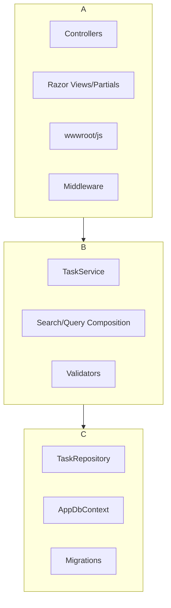
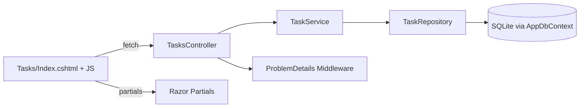
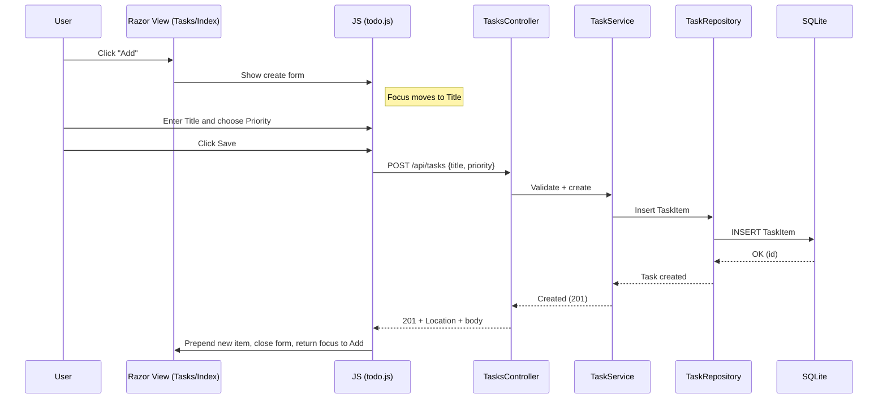

# High‑Level Technical Design — Todo App (MVP)

If any assumption conflicts with docs/final_requirements.md, prefer the requirements file and call out the conflict explicitly.

## Tech Stack & Rationale
- Backend: .NET 8 WebAPI (Controllers + Middleware)
  - Why: Mature, fast, first‑class ProblemDetails, easy DI, health checks.
- Data: EF Core 8 + SQLite (dev and single‑instance prod for MVP)
  - Why: Zero‑config dev, small footprint; clear migration path to Postgres.
- UI: Razor Views + Partials + vanilla JavaScript modules (fetch)
  - Why: Lowest complexity; progressive enhancement; no SPA framework needed.
- Validation: Data Annotations + FluentValidation (for complex rules)
- Mapping: Minimal DTOs; avoid heavy mappers; hand‑written or small helpers.
- Logging: Microsoft.Extensions.Logging with structured JSON; correlation ID via header `X-Request-ID`.
- Testing: xUnit, FluentAssertions, WebApplicationFactory for integration; manual UI checklist.
- CI/CD: GitHub Actions (restore/build/test/publish with caching); optional multi‑stage Dockerfile.

## Architecture & Layering
- Presentation: Controllers, Razor Views/Partials, static assets (wwwroot/js, css)
- Application/Services: TaskService, Query services (search/filter/sort/paging composition), Validators
- Infrastructure/Data: EF DbContext, Repositories, Migrations
- Cross‑cutting: Error Handling Middleware (ProblemDetails), Logging/Correlation Middleware, Security Headers, Health Checks

Allowed dependencies: Presentation -> Application -> Infrastructure. Cross‑cutting referenced by Presentation.

### Component Breakdown
- Controllers: `TasksController` (CRUD + PATCH + list with query), `HealthController` (`/health`)
- Services: `TaskService` (business rules, soft delete), `SearchService` (query composition)
- Repositories: `TaskRepository` (EF queries + specifications where helpful)
- DbContext: `AppDbContext` with entity configs and global query filters for soft delete
- Validators: `CreateTaskValidator`, `UpdateTaskValidator`, `PatchTaskValidator`
- Middleware: `ProblemDetailsMiddleware`, `CorrelationIdMiddleware`, `SecurityHeadersMiddleware`
- UI: `Views/Tasks/Index.cshtml`, partials `_TaskList.cshtml`, `_CreateTaskForm.cshtml` (inline or modal per T01), `wwwroot/js/todo.js`

## Data Model & Persistence
Entity: TaskItem
- id (GUID), title (<=200), description (<=1000?), dueDate (DateOnly?), priority (low|med|high), tags (string[]), completed (bool), createdAt, updatedAt, deletedAt (nullable), rowVersion (byte[])
- Indexes: createdAt DESC, dueDate, priority; optional index on `LOWER(title)`/`LOWER(description)` for LIKE NOCASE.
- Global Query Filter: exclude `deletedAt != null` by default (soft delete).
- Concurrency: RowVersion token for PUT/PATCH; map to 409 on mismatches.
- Search: case‑insensitive LIKE over title/description (SQLite `COLLATE NOCASE`). Consider FTS in a future ADR.

EF Core Configuration (DbContext + EntityTypeConfiguration)
- Keys, MaxLength, Required fields.
- Value conversions for tags (string[] <-> JSON text) in SQLite.

## API Design Conventions
- Routes
  - `GET /api/tasks?page=1&pageSize=20&q=&priority=low|med|high&tag=&sort=createdAt|dueDate|priority&order=asc|desc`
  - `POST /api/tasks` (create)
  - `GET /api/tasks/{id}` (detail)
  - `PUT /api/tasks/{id}` (replace)
  - `PATCH /api/tasks/{id}` (partial; e.g., `{ completed: true }` or other allowed fields)
  - `DELETE /api/tasks/{id}` (soft delete)
- Request/Response
  - JSON camelCase; list returns `{ items, page, pageSize, total }`
  - 201 Created with Location for POST
- Errors: RFC7807 ProblemDetails with validation map in `errors`.
- Versioning: None for MVP; keep URLs stable; consider `v1` in Phase 2.
- OpenAPI: Generate 3.1 spec in `docs/openapi.yaml` and keep in CI.

### OpenAPI 3.1 (YAML Excerpt)
```yaml
openapi: 3.1.0
info:
  title: Todo API
  version: 1.0.0
servers:
  - url: /
paths:
  /api/tasks:
    get:
      summary: List tasks
      parameters:
        - in: query
          name: page
          schema: { type: integer, minimum: 1, default: 1 }
        - in: query
          name: pageSize
          schema: { type: integer, minimum: 1, maximum: 100, default: 20 }
        - in: query
          name: q
          schema: { type: string }
        - in: query
          name: priority
          schema: { type: string, enum: [low, med, high] }
        - in: query
          name: tag
          schema: { type: string }
        - in: query
          name: sort
          schema: { type: string, enum: [createdAt, dueDate, priority] }
        - in: query
          name: order
          schema: { type: string, enum: [asc, desc], default: desc }
      responses:
        '200':
          description: OK
          content:
            application/json:
              schema: { $ref: '#/components/schemas/TaskListResponse' }
    post:
      summary: Create task
      requestBody:
        required: true
        content:
          application/json:
            schema: { $ref: '#/components/schemas/CreateTask' }
      responses:
        '201':
          description: Created
          headers:
            Location:
              schema: { type: string }
          content:
            application/json:
              schema: { $ref: '#/components/schemas/Task' }
        '400': { $ref: '#/components/responses/ValidationError' }

  /api/tasks/{id}:
    parameters:
      - in: path
        name: id
        required: true
        schema: { type: string, format: uuid }
    get:
      summary: Get task
      responses:
        '200': { description: OK, content: { application/json: { schema: { $ref: '#/components/schemas/TaskDetail' } } } }
        '404': { $ref: '#/components/responses/NotFound' }
    put:
      summary: Replace task
      requestBody:
        required: true
        content:
          application/json:
            schema: { $ref: '#/components/schemas/UpdateTask' }
      responses:
        '200': { description: OK, content: { application/json: { schema: { $ref: '#/components/schemas/Task' } } } }
        '400': { $ref: '#/components/responses/ValidationError' }
        '409': { $ref: '#/components/responses/Conflict' }
    patch:
      summary: Partial update (e.g., toggle completed)
      requestBody:
        required: true
        content:
          application/json:
            schema:
              type: object
              additionalProperties: false
              properties:
                title: { type: string, minLength: 1, maxLength: 200 }
                description: { type: string, maxLength: 1000 }
                dueDate: { type: string, format: date }
                priority: { type: string, enum: [low, med, high] }
                tags:
                  type: array
                  maxItems: 10
                  items: { type: string, maxLength: 30, pattern: '^[A-Za-z0-9_-]+$' }
                completed: { type: boolean }
      responses:
        '200': { description: OK, content: { application/json: { schema: { $ref: '#/components/schemas/Task' } } } }
        '400': { $ref: '#/components/responses/ValidationError' }
        '409': { $ref: '#/components/responses/Conflict' }
    delete:
      summary: Soft delete task
      responses:
        '204': { description: No Content }
        '404': { $ref: '#/components/responses/NotFound' }

components:
  schemas:
    Task:
      type: object
      required: [id, title, priority, completed, createdAt, updatedAt]
      properties:
        id: { type: string, format: uuid }
        title: { type: string, maxLength: 200 }
        description: { type: string, maxLength: 1000, nullable: true }
        dueDate: { type: string, format: date, nullable: true }
        priority: { type: string, enum: [low, med, high] }
        tags:
          type: array
          maxItems: 10
          items: { type: string, maxLength: 30 }
        completed: { type: boolean }
        createdAt: { type: string, format: date-time }
        updatedAt: { type: string, format: date-time }
        deletedAt: { type: string, format: date-time, nullable: true }
    TaskDetail:
      allOf:
        - $ref: '#/components/schemas/Task'
    TaskListResponse:
      type: object
      required: [items, page, pageSize, total]
      properties:
        items:
          type: array
          items: { $ref: '#/components/schemas/Task' }
        page: { type: integer }
        pageSize: { type: integer }
        total: { type: integer }
    CreateTask:
      type: object
      required: [title]
      additionalProperties: false
      properties:
        title: { type: string, minLength: 1, maxLength: 200 }
        description: { type: string, maxLength: 1000 }
        dueDate: { type: string, format: date }
        priority: { type: string, enum: [low, med, high], default: med }
        tags:
          type: array
          maxItems: 10
          items: { type: string, maxLength: 30, pattern: '^[A-Za-z0-9_-]+$' }
    UpdateTask:
      allOf:
        - $ref: '#/components/schemas/CreateTask'
  responses:
    ValidationError:
      description: Validation error
      content:
        application/json:
          schema:
            type: object
            properties:
              type: { type: string }
              title: { type: string }
              status: { type: integer }
              detail: { type: string }
              instance: { type: string }
              errors:
                type: object
                additionalProperties:
                  type: array
                  items: { type: string }
    NotFound:
      description: Not found
      content:
        application/json:
          schema: { $ref: '#/components/schemas/ProblemDetails' }
    Conflict:
      description: Concurrency conflict
      content:
        application/json:
          schema: { $ref: '#/components/schemas/ProblemDetails' }
  schemas:
    ProblemDetails:
      type: object
      properties:
        type: { type: string }
        title: { type: string }
        status: { type: integer }
        detail: { type: string }
        instance: { type: string }
```

## UI Architecture (Razor + Vanilla JS)
- Pages
  - `Tasks/Index.cshtml`: renders layout, filters, Add button (opens form), list partial.
  - `_CreateTaskForm.cshtml`: inline form or modal; opened via Add (T01).
  - `_TaskList.cshtml`: server template for list items; JS renders via small templating or DOM creation.
- JS Modules (`wwwroot/js/todo.js`)
  - api.js: fetch wrapper (JSON, error handling, correlation ID propagation)
  - state.js: URL <-> state sync (search, filters, sort, page)
  - ui.js: binds events for Add->Form->Save (T01), toggle, delete, pagination, filters, sort
- Progressive enhancement: server renders basic list; JS enhances interactivity (no full reloads for actions).
- Accessibility: proper labels, roles, focus management (form open/close returns focus to Add), contrast.
- Responsive: fluid layout; controls stack under 400px; min 44px tap targets.

## Cross‑Cutting Concerns & Best Practices
- Validation: Data annotations for simple rules + FluentValidation for cross‑field (e.g., title length, tag limits)
- Error handling: Central middleware catches exceptions, maps not found, validation, and concurrency to ProblemDetails
- Logging/Tracing: Structured logs with CorrelationId; echo `X-Request-ID` header; include path, status, duration
- Security: Same‑origin (CORS disabled); HSTS; X‑Content‑Type‑Options; X‑Frame‑Options DENY; basic self‑only CSP
- Health: `/health` returns 200 + DB ping
- Performance: server paging defaults (20, max 100); avoid N+1; indexes as above; no caching in MVP

## Testing Strategy
- Unit: TaskService (create/update/soft delete/toggle), validators (edge cases)
- Integration: WebApplicationFactory → exercise endpoints, ProblemDetails, paging/sort/filter/search
- UI: Manual checklist for key flows (T01–T10); consider Playwright later if scope grows

---

## Diagrams (Mermaid)

### Layered Architecture


### Components


### T01 Create Flow (Add → Form → Save)

