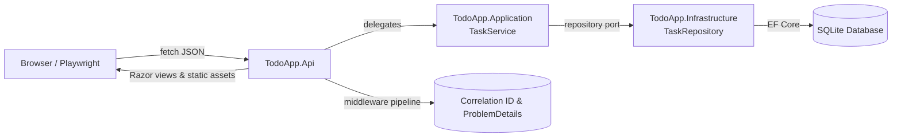
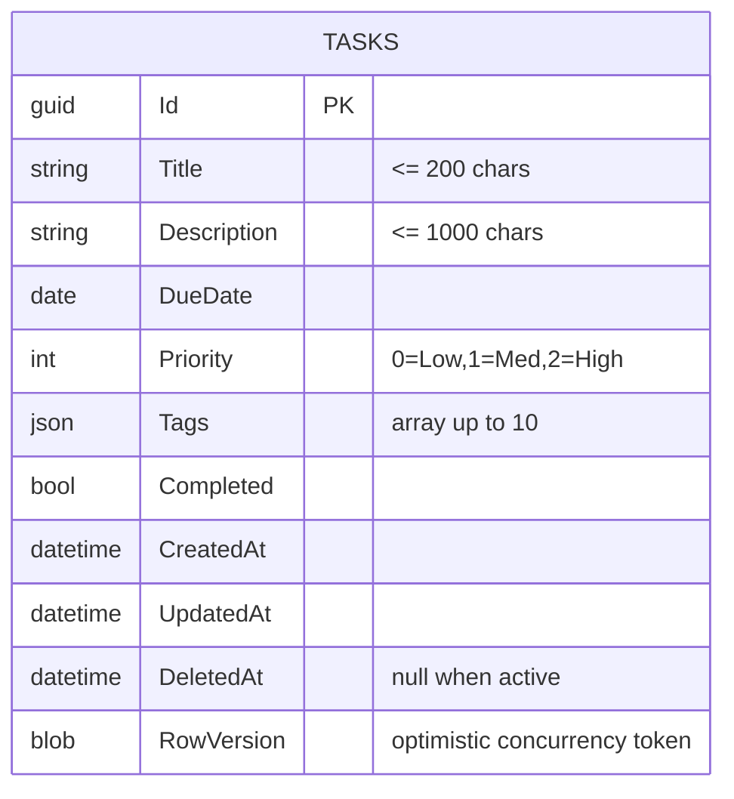

# Todo App

## Overview
Todo App is a .NET 8 web application that demonstrates a full clean architecture implementation for managing personal and team tasks. The solution exposes a REST API, a progressively enhanced Razor UI, and a persistence layer backed by Entity Framework Core with SQLite. Business logic such as validation, soft deletes, search, filtering, and optimistic concurrency lives in the application layer so it can be reused by any future front ends.

## Architecture


- **Presentation (TodoApp.Api):** Hosts both the REST controllers and Razor UI, configures middleware, security headers, and error handling.
- **Application (TodoApp.Application):** Holds DTOs, service orchestration, and validation rules that all clients must respect.
- **Infrastructure (TodoApp.Infrastructure):** Provides EF Core-backed repositories, migrations, and seeding.

## Technology Stack
- .NET 8 Web API with MVC and Razor Pages
- Entity Framework Core with SQLite provider
- xUnit + FluentAssertions + Moq for unit testing (project scaffolding ready)
- Playwright for end-to-end UI testing
- Bootstrap 5, vanilla JavaScript modules, and progressive enhancement for the UI

## Local Development
1. **Prerequisites:** .NET SDK 8.0, SQLite CLI (optional for inspection), Node.js (only if you want to extend frontend tooling).
2. **Restore & build:** `dotnet build src/TodoApp.Api/TodoApp.Api.csproj`
3. **Database:** The app auto-applies migrations and seeds sample data on startup. To reset, delete the SQLite file (`TodoApp.db` under `bin/Debug/net8.0`) and rerun the app.
4. **Run API & UI:** `dotnet run --project src/TodoApp.Api/TodoApp.Api.csproj`
5. **Open UI:** Navigate to `https://localhost:5001/tasks` for the interactive experience.
6. **Run health check:** `curl -k https://localhost:5001/health`
7. **Tests (recommended scaffolding):**
   - `dotnet test` (unit/service tests)
   - `pwsh ./scripts/run-playwright.ps1` (E2E, once playwright project is added)

## Database Schema Overview

Indexes: `IX_Tasks_CreatedAt`, `IX_Tasks_DueDate`, `IX_Tasks_Priority`. A global query filter excludes rows where `DeletedAt` is set, preserving soft-deleted records for auditing.

## API Endpoint Summary
| Method | Route | Description | Success Codes | Error Codes |
| --- | --- | --- | --- | --- |
| GET | `/api/tasks` | Paged search with free-text, tag, and priority filters. | 200 | 400 |
| GET | `/api/tasks/{id}` | Fetch a single task. | 200 | 404 |
| POST | `/api/tasks` | Create a task (requires due date and <=10 tags). | 201 | 400 |
| PUT | `/api/tasks/{id}` | Replace a task (requires rowVersion for concurrency). | 200 | 400, 404, 409 |
| PATCH | `/api/tasks/{id}` | Partially update a task (ignores null properties). | 200 | 400, 404, 409 |
| DELETE | `/api/tasks/{id}` | Soft delete a task. | 204 | 404 |
| GET | `/health` | Infrastructure readiness probe. | 200 | 503 |

Full OpenAPI specification: `TodoApp.Api/openapi.yaml`.

## Usage Examples
### 1. Create a new task
```bash
curl -k https://localhost:5001/api/tasks \
  -H "Content-Type: application/json" \
  -d '{
    "title": "Prep sprint demo",
    "description": "Collect highlights and blockers",
    "dueDate": "2025-10-01",
    "priority": 2,
    "tags": ["work", "planning"]
  }'
```
Response `201 Created` includes the full task payload and the `Location` header (`/api/tasks/{id}`).

### 2. Search, filter, and paginate
```bash
curl -k "https://localhost:5001/api/tasks?page=2&pageSize=5&q=report&priority=High&tag=work&sort=dueDate&order=asc"
```
Returns `TaskListResponse` with `items`, `page`, `pageSize`, and `total` fields so clients can render pagination controls.

### 3. Handle validation and concurrency errors
```bash
# Missing title -> 400 ProblemDetails
curl -k https://localhost:5001/api/tasks \
  -H "Content-Type: application/json" \
  -d '{"title":"","dueDate":"2025-01-01","priority":1}'

# Concurrency conflict -> 409 ProblemDetails
curl -k -X PUT https://localhost:5001/api/tasks/{id} \
  -H "Content-Type: application/json" \
  -d '{
    "title":"Prep sprint demo",
    "priority":1,
    "completed":true,
    "rowVersion":"stale-base64-token"
  }'
```
Both responses follow RFC7807 with `application/problem+json`, echoing `detail`, `status`, and `traceId`.

### 4. UI interactions
- Navigating to `/tasks` loads the Razor markup immediately; `todo.js` then hydrates the experience with client-side fetch calls.
- Filter dropdowns update query state and trigger debounced fetches to `/api/tasks`.
- Inline create/edit forms call the API and reuse validation messages surfaced by the service layer.
- Keyboard and screen-reader users benefit from Bootstrap focus styles, proper ARIA labels, and non-JavaScript fallbacks.

## Deployment Notes
1. Set the `ConnectionStrings:Default` entry (environment variable or `appsettings.Production.json`) to the target SQLite or SQL Server connection string.
2. Ensure the hosting environment runs `dotnet ef database update` or lets the app apply migrations on startup.
3. Configure reverse proxy TLS termination and forward headers if hosting behind Nginx/Apache.
4. Expose `/health` to platform probes and monitor correlation IDs (`X-Request-ID`) for distributed tracing.
5. Harden security: enforce HTTPS, supply Content Security Policy (extend `SecurityHeadersMiddleware`), and rotate seed data off in production.

## Further Reading
- Architecture deep dive: `docs/architecture.md`
- Layer-specific guides: see each `TodoApp.*` project README.
