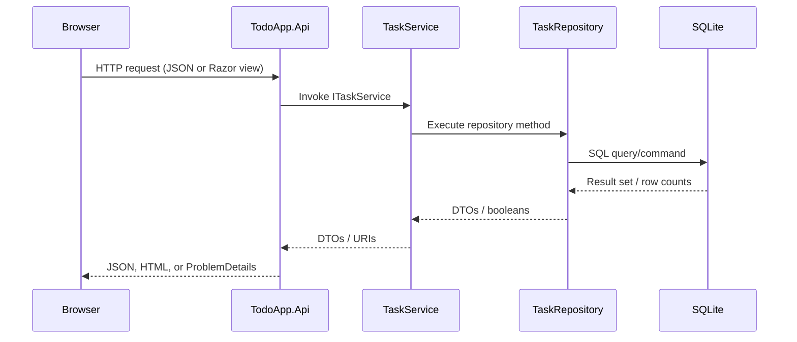
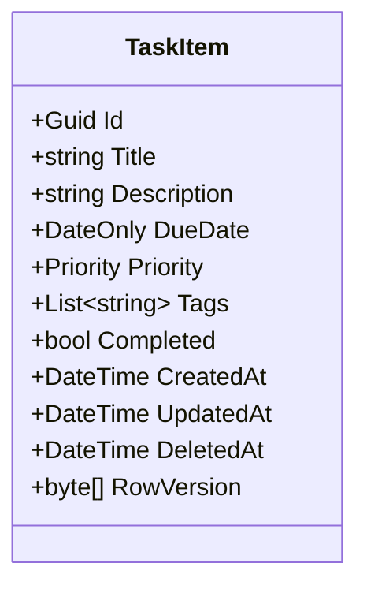

# Architecture Reference

## Layer Interaction


## Request Lifecycle
1. **Inbound headers**: `CorrelationIdMiddleware` attaches `X-Request-ID` and Activity tags.
2. **Business logic**: Controllers validate query parameters then dispatch to `TaskService`.
3. **Persistence**: `TaskRepository` composes EF Core queries, ensuring paging, filtering, and concurrency tokens are applied.
4. **Error handling**: Exceptions surface back to `ProblemDetailsMiddleware`, which emits RFC7807 responses for 400/409/500 paths.
5. **Security headers**: Added just before the response is written.

## Business Rules
- **Task validation** (enforced in `TaskService`):
  - Title required, trimmed, 1-200 chars.
  - Description optional, <= 1000 chars.
  - Due date required on create; optional on update/patch.
  - Tags optional, trimmed, max 10.
- **Soft delete**: `TaskRepository.SoftDeleteAsync` stamps `DeletedAt`. A global query filter hides deleted rows from all reads while retaining data for auditing.
- **Search**: Case-insensitive `LIKE` over title and description. Trimmed search term to prevent leading/trailing wildcards.
- **Tag filtering**: Applied in-memory due to SQLite JSON limitations; any matching tag qualifies the row (OR logic).
- **Concurrency**: Row version (`byte[]`) compared during update/patch. EF raises `DbUpdateConcurrencyException`, mapped to HTTP 409.

## Error Handling
- **400 Bad Request**: Validation failures (`ArgumentException`).
- **404 Not Found**: Missing task IDs (controller decides based on `null`).
- **409 Conflict**: Row version mismatch or concurrent updates.
- **500 Internal Server Error**: Unexpected exceptions; logged with correlation ID and trace identifier.

ProblemDetails payload shape:
```json
{
  "type": "about:blank",
  "title": "Conflict",
  "status": 409,
  "detail": "Update conflict. The resource was modified by another process.",
  "traceId": "00-abc123..."
}
```

## API Contract
- Complete specification stored at `../TodoApp.Api/openapi.yaml`.
- Controllers provide XML comments and response metadata so tools like Swashbuckle can auto-generate runtime docs if desired.

## Data Model

- Indices ensure performant list sorting (`CreatedAt`, `DueDate`, `Priority`).
- JSON serialization for `Tags` enables flexible metadata while keeping schema simple.

## UI Workflow
1. Razor markup renders instantly with server-side layout.
2. `todo.js` hydrates controls, binds event handlers, and loads data lazily via `fetch`.
3. Modals use Bootstrap for accessibility; focus management returns users to the trigger button.
4. Pagination and filters maintain internal state and automatically refresh list results.
5. Error banners surface API failures while the `X-Request-ID` header enables support teams to trace issues.

## Testing Strategy
- **Unit**: Mock `ITaskRepository` to validate service-level business rules.
- **Integration**: Use in-memory SQLite with migrations for repository/EF coverage.
- **Contract**: Validate responses against `openapi.yaml` (e.g., Spectral, Dredd).
- **UI**: Drive `/tasks` with Playwright to cover progressive enhancement and accessibility.

## Deployment Checklist
- Configure `ConnectionStrings:Default` per environment.
- Run database migrations before exposing the API.
- Wire `/health` into orchestrator probes.
- Monitor logs for correlation IDs and concurrency conflicts to detect conflicting user edits.
